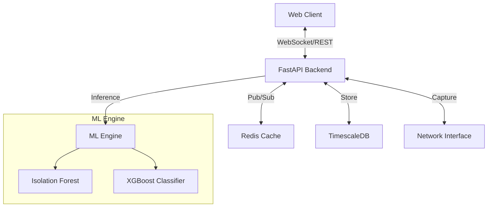

# SentinelFlow 🛡️

**ML-Powered Network Intrusion Detection System (NIDS)**

[](https://www.python.org/downloads/)
[](https://reactjs.org/)
[](https://fastapi.tiangolo.com/)
[](https://www.docker.com/)
[](https://opensource.org/licenses/MIT)

SentinelFlow is a state-of-the-art, real-time Network Intrusion Detection System (NIDS) that leverages advanced machine learning algorithms to detect and classify network anomalies. Built for enterprise-grade security, it integrates seamlessly with the **MITRE ATT&CK** framework to provide actionable threat intelligence.


---

## 🚀 Key Features

- **🧠 Advanced ML Detection**: Utilizes **XGBoost** for attack classification and **Isolation Forest** for zero-day anomaly detection.
- **⚡ Real-Time Monitoring**: Captures and analyzes network packets in sub-millisecond timeframes using **Scapy** and **WebSockets**.
- **📊 Interactive Dashboard**: A modern, dark-mode React UI for visualizing traffic flows, attack timelines, and threat distribution.
- **🛡️ MITRE ATT&CK Integration**: Automatically maps detected threats to specific Tactics and Techniques (e.g., *T1595 - Active Scanning*).
- **📩 Smart Alerts**: Configurable email notifications for critical threats.
- **🔒 Role-Based Access Control**: Secure authentication system with Admin and Observer roles.
- **📈 Historical Analysis**: Time-series analysis of network traffic using **TimescaleDB**.
- **🐳 Dockerized Deployment**: Fully containerized architecture for easy deployment.

---

## 🏗️ System Architecture

SentinelFlow employs a microservices architecture to ensure scalability and resilience.

### High-Level Architecture



### Technology Stack

| Component | Technology | Description |
|-----------|------------|-------------|
| **Backend** | Python 3.12, FastAPI | High-performance async API and WebSocket server. |
| **Frontend** | React 18, TypeScript, Vite | Responsive SPA with real-time data visualization. |
| **Database** | TimescaleDB (PostgreSQL) | Optimized time-series database for traffic logs. |
| **Caching** | Redis | Message broker for WebSockets and caching layer. |
| **ML Core** | Scikit-learn, XGBoost | Models for anomaly detection and classification. |
| **Network** | Scapy, Libpcap | Low-level packet capture and parsing. |
| **Container** | Docker, Docker Compose | Orchestration of services. |

---

## 🧠 Machine Learning Pipeline

Our detection engine is trained on **1.9 million** network flows, achieving **98.8% accuracy** in validation.

### Models
1.  **Isolation Forest**: Unsupervised learning model to detect unknown anomalies (Zero-day attacks).
2.  **XGBoost Classifier**: Supervised learning model to classify attacks into 8 categories.

### Supported Attack Categories
- **Credential Access** (e.g., Brute Force)
- **Defense Evasion**
- **Exfiltration**
- **Initial Access**
- **Persistence**
- **Privilege Escalation**
- **Reconnaissance** (e.g., Port Scanning)

### Datasets Used
- **CESNET-TimeSeries24**: For robust anomaly baseline training.
- **UWF-ZeekData22**: For comprehensive attack signature training.

---

## 🛠️ Getting Started

### Prerequisites
- **Docker** & **Docker Compose**
- **Node.js 18+** (for local frontend dev)
- **Python 3.12+** (for local backend dev)
- **Linux Environment** (Recommended for packet capture)

### 🐳 Installation (Docker - Recommended)

1.  **Clone the Repository**
    ```bash
    git clone https://github.com/Startdust41/SentinelFlow.git
    cd SentinelFlow
    ```

2.  **Configure Environment**
    Copy the example configuration:
    ```bash
    cp .env.example .env
    ```
    *Edit `.env` to set your `CAPTURE_INTERFACE` (e.g., `eth0` or `wlo1`).*

3.  **Start Services**
    ```bash
    docker-compose up -d --build
    ```

4.  **Access the Application**
    - **Frontend**: http://localhost:3000
    - **API Docs**: http://localhost:8000/docs
    - **DB Admin**: http://localhost:5050 (pgAdmin)

### Default Credentials
- **Username**: `admin`
- **Password**: `admin123`

---

## 💻 Local Development Setup

If you prefer running services locally for development:

**1. Backend**
```bash
cd backend
python -m venv venv
source venv/bin/activate
pip install -r requirements.txt

# Run with sudo for packet capture capability
sudo venv/bin/python -m uvicorn app.main:app --reload --host 0.0.0.0
```

**2. Frontend**
```bash
cd frontend
npm install
npm run dev
```

---

## 🛡️ Usage Guide

### 1. Dashboard Overview
Upon logging in, you are greeted with the comprehensive dashboard showing active monitoring status, traffic statistics, and recent alerts.

### 2. Monitoring Network
- Go to the **Network Monitoring** panel.
- Select your interface (e.g., `wlo1`).
- Click **Start Monitoring**.
- Watch as traffic flows and alerts populate in real-time.

### 3. Simulating Attacks
To test the detection capabilities, you can simulate a reconnaissance attack using `nmap`:

```bash
# Run a SYN scan (Replace target IP with your local IP)
sudo nmap -sS -T4 192.168.1.X
```

*You should see a **"Reconnaissance"** alert appear on the dashboard instantly.*

---

## 🤝 Contributing

Contributions are welcome! Please follow these steps:
1.  Fork the repository.
2.  Create a feature branch (`git checkout -b feature/AmazingFeature`).
3.  Commit your changes (`git commit -m 'Add some AmazingFeature'`).
4.  Push to the branch (`git push origin feature/AmazingFeature`).
5.  Open a Pull Request.

---

## 📜 License

Distributed under the MIT License. See `LICENSE` for more information.

---

## 👥 Team

- **Muhammad Umar Maqsood** (Lead Developer & ML Engineer)
- **Shamina Durrani** (Frontend Developer)
- **Muhammad Younas** (Backend Developer)

**Supervisor**: Dr. Muhammad Zain Siddiqi  
**Institution**: GIK Institute of Engineering Sciences and Technology
